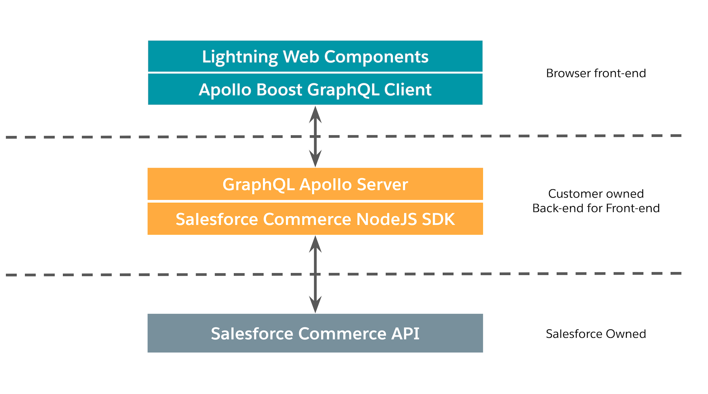
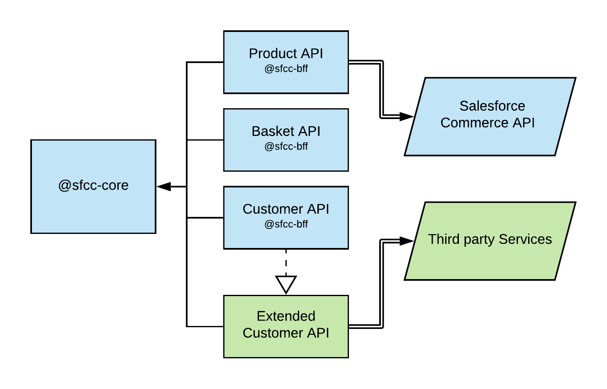

# Architectural Overview

The sample app showcases the capabilities and best practices of building an ecommerce application on top of the Salesforce Commerce API (a headless RESTful API). _It's not a complete reference architecture._ The sample app consists of a NodeJS web server that acts as a back-end for front-end (BFF) to a storefront built with Lightning Web Components.

## Tech Stack

#### Lightning Web Components
The application front-end is built with [Lightning Web Components](https://lwc.dev/) (LWC). LWC is a Salesforce framework for building user experiences in modern JavaScript and native web components. It uses the latest web standards and it allows you to build components once and reuse them with other frameworks.

#### GraphQL and Apollo
The front-end client communicates with the BFF via GraphQL. GraphQL provides validation, type checking, and minimizes the data transfer between the BFF and client. The sample app comes with the interactive API explorer [GraphiQL](https://github.com/graphql/graphiql). Access GraphiQL by booting the sample app and navigating to http://localhost:3000/api. The sample app relies on [Apollo](https://www.apollographql.com/) for both the client and server side implementation of GraphQL. Apollo is an industry-standard technology for GraphQL.

#### Salesforce Commerce NodeJS SDK
Salesforce provides a NodeJS library that wraps the Salesforce Commerce API and exposes a TypeScript-based interface. The library supports autocomplete features within your IDE, allowing you to view available methods, parameters, and class definitions inline in the code. The SDK is also promised-based, which makes writing `async` functions for complex operations easy. Read more about the SDK at: https://github.com/SalesforceCommerceCloud/commerce-sdk

#### Salesforce Commerce API
Visit the [Commerce Cloud Developer Center](https://developer.commercecloud.com/) to learn more about the Salesforce Commerce API. The Developer Center has API documentation, getting started guides, community forums, and more.

## Project and Package Structure
Though the sample app currently only communicates with the Salesforce Commerce API, a real world storefront would likely have multiple data sources. The sample app architecture is setup to easily support many data sources. As a result, the project is a monorepo with multiple packages managed by [Lerna](https://github.com/lerna/lerna). The managed packages in the sample app are grouped into three categories:

#### @sfcc-core
Core modules for the BFF, including a service and extension registry and a logging abstraction.

#### @sfcc-bff
Data source implementation for the Salesforce Commerce API. It includes the GraphQL models and query and mutation resolvers. If you were to add a new data source to another API, another package grouping similar to `@sfcc-bff` should be created. Do not mix data sources within the same package of GraphQL models and resolvers.

#### storefront-lwc
Front-end application, built with [lwc-services](https://www.npmjs.com/package/lwc-services).

## Session Management

To learn about session management in the sample app please see [session management](sessionManagement.md) 

## Customizing and Extending
When customizing or extending the sample app, do not modify the packages within `@sfcc-bff` and `@sfcc-core`. These packages will be published and consumed via NPM. Instead, create a new custom package within the monorepo that registers itself with `@sfcc-core` and provides access to data from a third-party service. For more information, see [Component Extension](componentExtension.md).

The core-graphql module within `@sfcc-core` is responsible for getting all the registered API modules, looping over them, aggregating the schemas and resolvers, and then starting the Apollo Server with which the Apollo Client will communicate. To create a new BFF API module, we have to register it with core, create the schema and resolvers needed, and expose them to the core-graphql module for aggregation through factory functions in the core-graphql module. 

## What's Not Included?
This is a sample application, and is not intended to be a full reference architecture. There are multiple components missing, some of which will be added in the future. Specifically, the app does not currently include:

1. **Authentication** - Required for a fully functional basket and checkout experience.
2. **CMS Integration** - Required to customize the storefront experience per user.
3. **Server-side Rendering** - Required for product listing search engine optimization.
4. **Component Portability** - Work needs to be done to re-use components outside of the sample app context.
