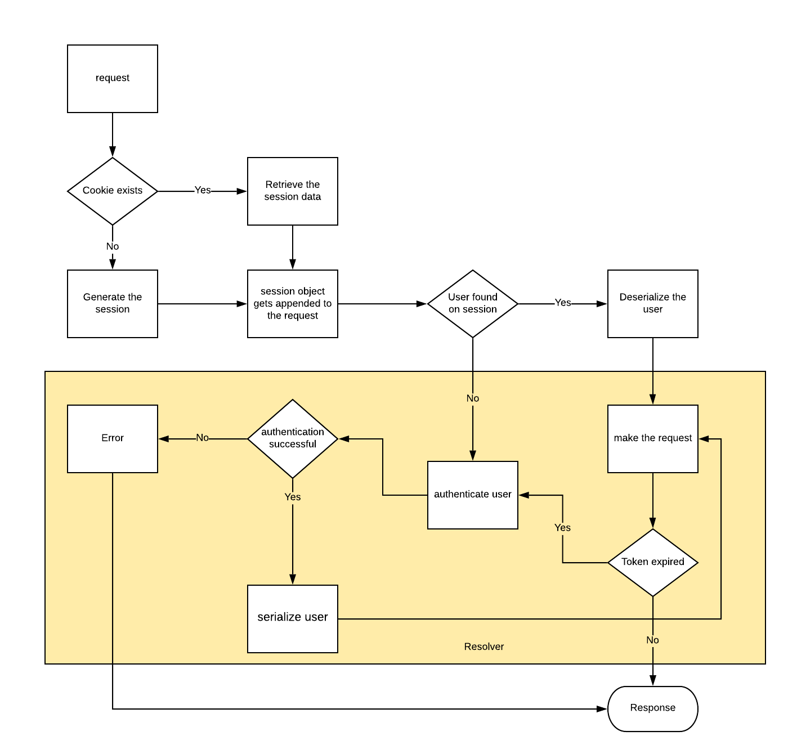

# Session Management

When the client loads the Sample App, the Sample App is initialized with the express authentication middleware, [passportjs](http://www.passportjs.org/). After initialization, `passport.session` is invoked to generate a session. A cookie is also generated (using [express-session](https://www.npmjs.com/package/express-session) to represent the session. 

The Sample App uses `GraphQLLocalStrategy` from the [graphql-passport](https://www.npmjs.com/package/graphql-passport) package for its authentication strategy. 

Authentication enables end users to perform actions like creating a basket. 

After successful authentication, the anonymous user ID is stored in the session corresponding to the generated cookie. 


## Session Management and Authentication Flow



The Sample App uses the `express-session` module to generate a unique cookie that represents the session. The default cookie used for the session ID is `connect.sid`. When the cookie expires, the module automatically creates a new one.

Passport middleware provides functions to serialize and deserialize a user to and from the session. As stated in the [architecture document](architecture.md), the front-end client communicates with the BFF via GraphQL. In the Sample App, every query using GraphQL uses the `/api` route. GraphQL separates queries based on resolvers in Sample App. 

An authentication request is needed to get an access token that allows the Sample App to perform certain actions, such as creating a basket or adding products to a basket. The Sample App uses the package `graphql-passport` to provide the functionality to authenticate with passport.


GraphQL provides a `context` object which is the third parameter passed to any resolver. The `context` object is generated per request and can store data used by the resolver. The Sample App populates this `context` object in the `[graphql.ts](../packages/@sfcc-core/core-graphql/src/graphql.ts)` file (which is in the `core-graphql` package). The `context` function defined in `graphql.ts` takes two parameters, request (req) and response (res).

```typescript
this.apolloServer = new ApolloServer({
    schema,
    context: ({ req, res }) => ({
        ...graphqlPassport.buildContext({ req, res }),
        setSessionProperty(key: string, value: string) {
            (req as Request).session[key] = value;
        },
        getSessionProperty(key: string) {
            return (req as Request).session[key];
        },
    }),
});
```

The request parameter is the same request object that express generates and is the actual web service call that contains the request headers, cookies, and so on. In the context function, the helper function `buildContext()` (which is provided by graphql-passport) helps build a context that is unique for each user, adding methods to the context to help authenticate using passport. After the `context` object is built, a resolver can ensure that the user is authenticated.

The resolvers in Sample App need to retrieve the user from the context. To help with this operation, Sample App defines a function `getUserFromContext()`. This function calls the `context.authenticate()` function provided by graphql-passport. 

```typescript
export async function getUserFromContext(context: AppContext) {
    let user = context.getUser();
    const token = user ? user.token : '';
    if (!token) {
        const res = await context.authenticate('graphql-local', { token });
        context.login(res.user);
        user = res.user;
    }
    return user;
}
```

The `context.authenticate` function calls the graphql-passport strategy configured in [runtime.js](../packages/storefront-lwc/scripts/runtime.js). This is the central location to perform the authentication logic.

```typescript
passport.use(
    new graphqlPassport.GraphQLLocalStrategy(function(user, pass, done) {
        const clientConfig = getCommerceClientConfig(config);
        CommerceSdk.helpers
            .getShopperToken(clientConfig, { type: 'guest' })
            .then(token => {
                const customerId = token.getCustomerInfo().customerId;
                done(null, {
                    id: customerId,
                    token: token.getBearerHeader(),
                });
            })
            .catch(error => done(error));
    }),
);
```

In Sample App’s authentication configuration, the shopper token is retrieved from the Commerce SDK. From this token, the anonymous user customer ID is determined. If authentication is successful, a user is returned containing the id and the bearer token. Following successful authentication, the `getUserFromContext()` function calls `context.login()` -- which invokes `passport.serializeUser`:

```typescript
passport.serializeUser(function(user, done) {
    users.set(user.id, user);
    done(null, user.id);
});
```

The above function is used to serialize the user to the in-memory `users` object for the session.
